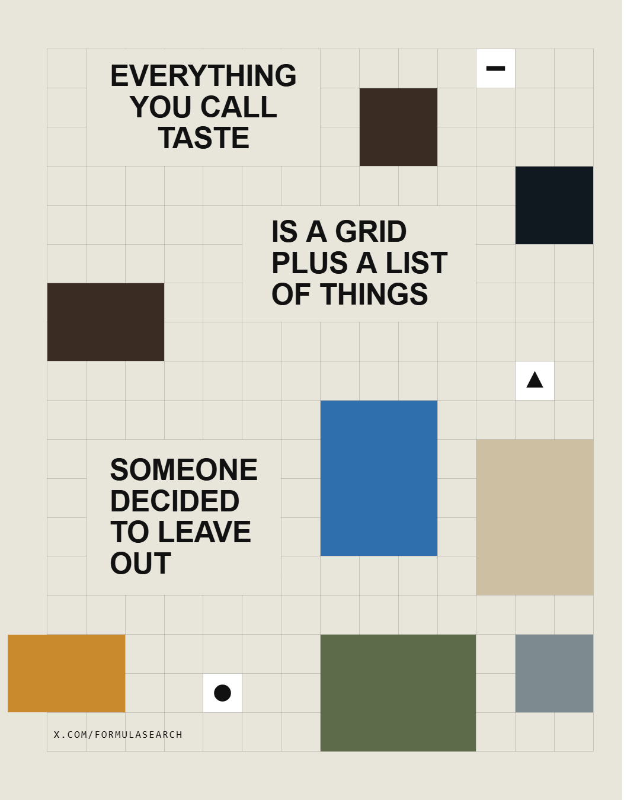

# 审美分享-06：模块网格拼贴海报

> 原帖：<https://x.com/Formulasearch> ｜ 2026-08 ｜ 参考图作者 [DREX.ART](https://www.drex.art)

## 适用于

**它不是网页首页**，是一张 4:5 的竖版海报 / 社媒图。但这套语言两边都成立：

- **原生场景**：宣言型海报、品牌年度总结、活动主视觉、书或播客封面、slide 的开篇页
- **搬进网页**：agency / portfolio 的首屏 hero、品牌 about 页、manifesto 页 —— 因为它天生就是「一句话 + 一堆证据图」的结构，把画布换成 16:9 就能直接当首屏
- **不适合**：信息密集的说明、需要精确阅读顺序的正文、内容要频繁改的页面

判断标准很简单：**你有一句值得拆开慢慢读的话，并且手上有一堆能当证据的图。**两个都有才用它，缺一个都会垮。

## 原帖观点

参考图看起来是"随便贴"，其实是四条硬规则：

1. **网格是吸附器，不是背景装饰。**所有图块的四条边都压在网格线上，没有任何一块是斜的、错位的、或者跨半格的。网格线本身留在画面里可见 —— 它是在告诉你"这些位置不是我随手放的"。
2. **文字不是标题，是一句被拆开的话。**四块文字沿之字形从左上走到右下，读完是完整一句。阅读顺序本身就是构图 —— 眼睛的路径决定了图块能放在哪。而且**每块文字自己也占着整数个格子，身下的网格线是被盖掉的** —— 文字不是浮在网格上面，它和图块一样是网格里的一个居民。
3. **图块之间永远不贴边。**任意两张图之间至少空一格。挨在一起的两块会立刻读成一整块，网格感就没了。
4. **图块尺寸只有有限几种，全是整格跨度。**2×3、3×2、2×2、3×4……外加 1×1 的小方块专门放 logo。尺寸的节奏差异是构图的一部分。

还有一条藏得比较深：**一两块图故意探出网格边缘**。全部规规矩矩关在框里会太乖，探出去的那一块让整张图有了"这是被人摆出来的"的手感。

顺带一提，参考图里那堆图片不是乱选的 —— 壁画、轮子、狮身人面、蒙娜丽莎、报纸、相机、iPhone、Tesla/OpenAI，是一条按时间排的文明线索。**图块的选择也在讲一个故事，不只是填空隙。**

## 效果预览



上图是打开工具的默认状态（色块是占位，拖入自己的图片即可替换）。在线直接玩：

**<https://fanzr-arch.github.io/Phil-aesthetic-formulas/006-grid-collage-poster/template/>**

## 拿走即用

本期类型：**代码模板 + 可嵌入引擎**

### 1. 当工具用

打开 [template/index.html](template/index.html)（双击即可，零依赖零构建）：

- 左边填文案，**空行分块** —— 每一块是阅读路径上的一站
- 拖多张图片进画布，按图块顺序填入；拖到某一格上，就从那一格开始填
- 点画布 = 换一批排布（文字块位置、图块尺寸和分布全部重算）；满意的那一版把「排布种子」记下来，下次填回去就能复现
- 画幅可切 4:5 / 1:1 / 2:3 / 16:9，字号会自动收到放得下为止
- 「导出 PNG」拿图，「导出代码」拿当前这一版的参数

### 2. 嵌进自己的项目

把 [`grid-collage.js`](template/grid-collage.js) 拷进项目（单文件，约 18KB，无依赖）：

```html
<canvas id="poster"></canvas>

<script src="grid-collage.js"></script>
<script>
  const g = GridCollage.create(document.getElementById('poster'), {
    width: 1440, height: 810,        // 当网页首屏就用 16:9
    text: 'WE MAKE\nTHINGS\n\nTHAT OTHER\nPEOPLE\nUSE',
    footer: 'STUDIO.EXAMPLE',
    cols: 13,
    tiles: 12,
  });
  g.setImages(['work-1.jpg', 'work-2.jpg', 'work-3.jpg']);
</script>
```

工具里的「导出代码」会把你**当前调好的全部参数**写成 HTML / React / JSON 三种片段，复制即用。注意导出里带着 `seed` —— 排布是由它决定的，不带就不是你看到的那一版。

### API

| 方法 | 说明 |
|---|---|
| `GridCollage.create(canvas, options)` | 创建实例 |
| `setImages(list, from)` | 按图块顺序填图，`from` 指定起始格；元素可以是 URL / `File` / `Blob` / `` / `<canvas>` |
| `setImageAt(index, src)` | 只换某一格 |
| `setOptions(patch)` | 改参数并重排（同 seed 结果稳定） |
| `reseed(seed)` | 换一批排布，不传则随机 |
| `photoAt(x, y)` | 画布坐标 → 图块序号，用来做"拖到哪格填哪格" |
| `stats()` | `{ requested, placed, photos }`，`tiles` 是上限不是保证，`photos` 才是 `setImages` 的有效长度 |
| `toDataURL()` | 导出图片 |
| `destroy()` | 释放 |

主要参数见 `GridCollage.DEFAULTS`，每项都有注释。

## 复刻笔记

### 「分成几条带、每块占一条」在扁画幅会直接崩

第一版按块数把画面等分成几条水平带，每块在自己那条带里居中加抖动。竖版好好的，一切到 16:9 三块文字整个叠在一起 —— 因为 1440×810 只放得下 6 行网格，而每块文字要 4 行，带高不到 2 行，三块全被 clamp 到了同一个位置。

改成两步：**先按可用行数把字号收到放得下**（`while (needRows > textRows) fontPx *= 0.93`），**再顺序往下摞**，剩余行数当作 n+1 段空隙分掉。顺序摞的好处是"不重叠"由结构保证，而不是靠参数碰运气。

空隙权重也不能全随机：块间的权重要明显高于上下两端，否则经常出现两块贴在一起、另一头空一大片。

### 图块散布：纯随机会结块

随机取位置 + 检查是否空闲，结果是图块挤成几团、大片区域全空。原因是随机采样本身没有"排斥"。

改成三条叠加：

1. **最远候选点**（Mitchell best-candidate）：每块先采一批合法位置，挑离已放图块中心最远的那个；
2. **最小间距**：候选点与任何已放图块的中心距离不得小于 `√(格子总数 / 图块数) × 0.85`，放不下就把这个阈值逐步放宽；
3. **强制留空**：每块登记占位时向外扩一格，保证任意两块之间至少空一格。

第 3 条对画面的改善最大 —— 它直接对应参考图里"没有任何两块贴边"这条规则。只做 1、2 的话，两块图仍然可能刚好挨上，一挨上就读成一整块。

### 文字块是网格里的一块地，不是浮在网格上的一层字

第一版把文字直接画在网格上，网格线从字缝里穿过去。看着"能用"，但和参考图放一起就差一口气 —— 文字像是后期贴上去的浮层，而图块是嵌在网格里的。

回看参考图才注意到：**每块文字身下的网格线是没有的**。也就是说文字块和图块是同一类东西 —— 都占着整数个格子，都盖掉自己底下的网格。改法很简单：文字块按整格算出 `cw × ch`，渲染时先用纸色填满这块矩形，再画字。

跟着还得改两件事。

一是**字要在这块底板里居中，而不是贴着顶边**。贴顶的时候最后一行离底边会空出一截，底板看起来像没装满。上下各留半格余量、整体居中之后，文字块才真的像一块被规划出来的地。

二是**底板和图块四周那一圈线要留着**。全填掉的结果是网格在这里整块断掉 —— 底板变成了一个"洞"，而不是"网格里的一格"。这一条比想象中难做对，见下面两节。

### 只能有一个坐标来源

补边框时踩了个更根本的坑：网格线画在 `Math.round(gx + i × cell)`，而图块用的是 `gx + col × cell` 的浮点值。两边差半个到一个像素，放大看就是"两套系统在打架" —— 图块边缘和它本该压着的那条网格线是错开的，补上的边框也跟着错。

改法是把坐标收成**唯一来源**：

```js
function gridX(i){ return Math.round(gx + i * cell); }
function gridY(j){ return Math.round(gy + j * cell); }
```

网格线、文字底板、图块，全部只从这两个函数取位置，任何地方都不再自己算 `gx + i * cell`。图块也不再存像素坐标，只存 `col / row / cw / ch`，要画的时候统一转换。

### 边框不该描 —— 它本来就是网格线

坐标对齐之后还是不对：文字块四周的框线明显比周围的网格重。

原因是**同一条线被画了两遍**。网格先整张画一遍；底板 `fillRect(x0, y0, x1-x0, …)` 覆盖的是像素 `x0 … x1-1`，所以左边那条线被盖掉了、**右边那条活着**。这时再描一圈边框，右边和下边就是"原有的线 + 新描的线"两次 alpha 叠加：`0.16` 变成 `1-(1-0.16)² ≈ 0.29`，几乎两倍深。左边和上边只画了一次。四条边两种深浅，看上去就是"边框比网格重"。

想通之后发现描边这一步整个是多余的：**边框和网格线是同一条线**。底板要做的只是盖住内部，不要碰四周那一圈。所以填充区域左上各让开一个线宽：

```js
// 线宽 lw 的竖线画在 [gridX(i), gridX(i)+lw)
// 从 x0 铺到 x1 会盖掉左边那条、盖不到右边那条 —— 所以只让开左上
{ x: x0 + lw, y: y0 + lw, w: x1 - x0 - lw, h: y1 - y0 - lw }
```

图块同理。这样全画面只有一次 `stroke()`，每条线严格只被画一次，粗细深浅由结构保证一致 —— 不是调出来的。探出网格的那几条边本来就没有线，判断一下不让开即可，也不需要额外裁剪。

验证方式是直接读像素：扫几条横竖扫描线，所有网格线、所有底板边框、所有图块边框读数**全部是 198**（纸 232、墨 17、alpha 0.16 → `232 + (17-232)×0.16 ≈ 198`）。眼睛容易被"线旁边是不是空的"骗，读数不会。

（奇数线宽还要偏半像素，否则 canvas 会把 1px 的线糊成 2px 的灰带 —— 这条是老生常谈，但和上面两条一起犯的时候很难分辨到底是哪个在作怪。）

顺带确认了文字块确实完全落在网格内 —— 横向 `cw = ceil((textW + 半格) / cell)`、纵向同理并按大写/小写算下伸部，位置再 clamp 到 `[0, cols-cw]` / `[0, textRows-ch]`。

不想要这个效果可以关掉（`textPanel: false`），网格线就会照旧从字缝里穿过去，是另一种更"图层感"的风格。

### 文字和图块共用同一张占位表

一开始分了两张表：文字本体一张、文字加保护带一张，想让 logo 小方块能贴着大字放、照片则必须隔开。实际渲染出来 logo 老是紧贴文字左边缘，看着像撞上了而不是像故意的。

回头数了参考图 —— Tesla、Nike、Instagram、OpenAI 那几个小方块，**每一个都离文字整整一格**。所谓"贴着放"是我自己脑补的。合并成一张表之后代码短了一截，画面也对了。

### 照片最小 2×2

放不下时会降级尺寸重试。降到 1×1 时画面里会出现和 logo 格一样大的照片，两种角色立刻混淆。所以照片的降级只到 2×2，再放不下就干脆不放这一块 —— 少一块图远比多一块看起来像 bug 的图好。

工具里图块数量是"上限"不是"保证"，扁画幅或文字很满时实际放下的会少一些。

### 为什么没有内置示例图片

上一期（[005](../005-typographic-portrait/)）为了在 `file://` 下能用，把示例照片存成了 data URI，代价是 84KB base64 塞进 js。这一期需要十来张图，走同一条路会把文件撑到几百 KB。

改成**占位色块**：没放图的格子填一个调色板颜色，logo 格填白底加一个几何标记。好处是零字节、并且明确在说"这里等着你放图"；坏处是默认状态偏抽象。取舍下来觉得值 —— 这个工具的输入本来就该是用户自己的图，内置一套别人的图反而误导。

顺带避开了同源策略那个坑：本地拖进来的 `File` 走 `FileReader` 转 data URI 再进 canvas，`toDataURL()` 不会因为跨源被污染。

### 字号和图块数量是同一个参数的两面

做完一轮之后回头量了个数据：**参考图里最宽的一行文字，只占网格宽度的 32%**。而我当时的默认值（`fontSize: 0.88`、13 列）量出来是 **43%**。

差的这 11% 不只是"看起来字大了点"。文字块四周还有 1 格保护带，43% 宽的块加保护带就吃掉近 70% 的宽度，图块只剩边角能站。实测默认状态下**要 12 块只放下 9 块，其中能放照片的格子只有 6 个** —— 用户拖 12 张图进来，一半用不上。

一开始怀疑是摆放算法漏了空位，于是把最后那轮兜底改成全盘扫描（随机采样 160 次确实会漏掉稀疏的空位）。改完还是 9 块 —— 说明不是漏了，是真的没地方。

扫了一遍 `fontSize` × `cols` 的组合（每格 15 个种子取平均）：

| fontSize | cols | 文字宽度占比 | 平均放下 | 图位 |
|---|---|---|---|---|
| 0.88 | 13 | 43% | 8.9 | 6.0 |
| 0.88 | 14 | 40% | 10.5 | 7.5 |
| **0.76** | **14** | **34%** | **11.3** | **8.3** |
| 0.70 | 14 | 32% | 11.3 | 8.3 |
| 0.62 | 14 | 28% | 11.9 | 8.9 |

定在 `fontSize: 0.76` + `cols: 14`：文字宽度 34%，最接近参考图又不至于让标题失去分量。**这两个值是连动的，别只调一个** —— 把字号推到 1.2 就得同时把图块数量往下调，否则界面上写着 12 块、实际只放下五六块。

界面上也把真实数字写出来了（`stats()` 返回 `requested / placed / photos`），差得多的时候会提示"空间不够"。导出代码里的 `setImages([...])` 也按真实图位数生成，不再是写死的三个占位路径。

### 其它参数取舍
- `cols` 默认 14。参考图数下来是 12×14，但它的字更小。列数越多格子越小，图块看起来越"碎"。
- `textPad` 是文字底板四周的保护带，默认 1 格。调到 0 会得到文字和图块互相咬合的紧凑版，也是一种风格 —— 顺带能多放两三块图。
- `textPanel` 默认开。关掉就是"文字浮在网格上"的图层感版本，可以直接对比这一条规则的分量。
- `seed` 决定这一版排布。界面上是可读可写的输入框：换到满意的一版就把数字记下来，下次填回去还是这一版。导出代码里也会带上它。
- `bleed` 默认 1，也就是允许一块探出网格边缘。调到 0 画面会立刻变"乖"，可以直观感受这一条规则的作用。

## License

MIT，随便拿。
