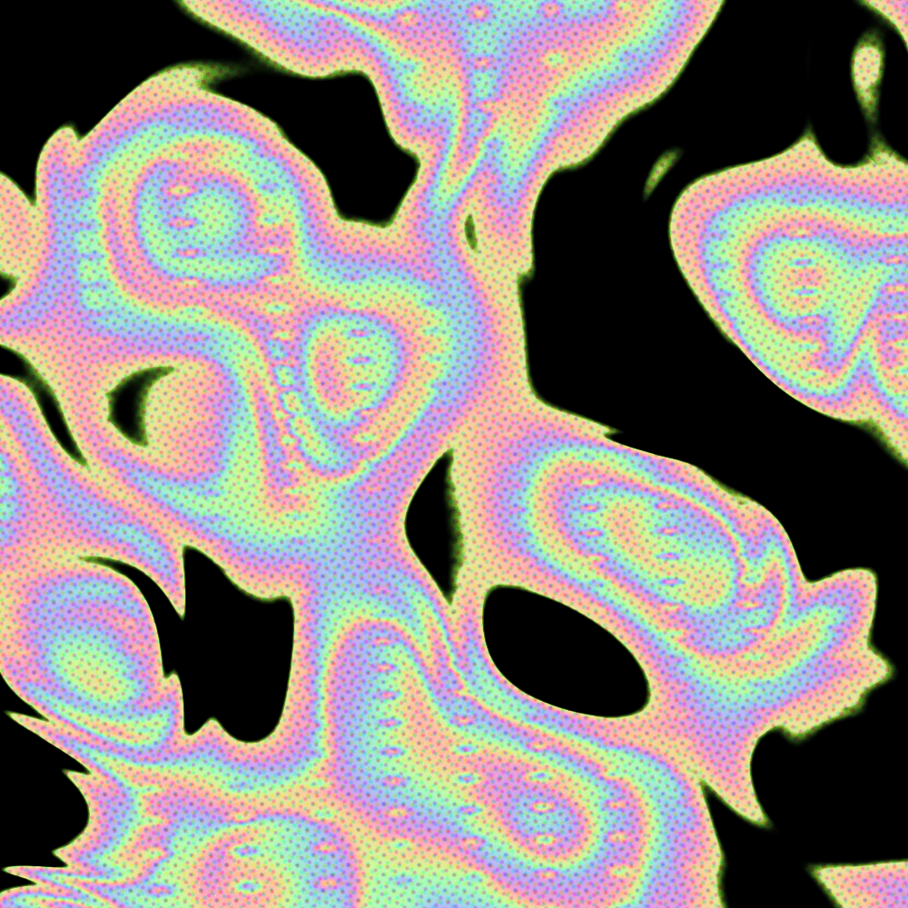

# 审美分享-07：虹彩液态 × RGB 网点

这期不是从零写一个“看起来像流体”的动画，而是把三个成熟的开源实现组合成一条可控管线：

1. **液态形变**：复用 [collidingScopes/liquid-shape-distortions](https://github.com/collidingScopes/liquid-shape-distortions) 的 WebGL shader；
2. **虹彩映射**：复用 [Erkaman/glsl-cos-palette](https://github.com/Erkaman/glsl-cos-palette) 整理的 Inigo Quilez cosine palette；
3. **网点与错版**：复用 Three.js 官方 [DotScreenShader](https://github.com/mrdoob/three.js/blob/dev/examples/jsm/shaders/DotScreenShader.js) 的网点公式，把 RGB 三个色版分别旋转并轻微错位。

最终是一个离线可运行的 WebGL 工具：采用自制的印刷实验台界面，提供固定 seed、六套确定性配方、六种强风格抽奖、28 项细分参数、参数存档与 JSON 导入、暂停、PNG 截图、MP4 导出和专注模式。

## 效果预览



在线直接玩：

**<https://fanzr-arch.github.io/Phil-aesthetic-formulas/007-iridescent-flow-halftone/template/>**

## 为什么选这套现成轮子

调研时对比了两条路线：

| 候选 | 擅长 | 与参考图的差距 | 结论 |
|---|---|---|---|
| [PavelDoGreat/WebGL-Fluid-Simulation](https://github.com/PavelDoGreat/WebGL-Fluid-Simulation) | 鼠标喷墨、烟雾扩散、真实二维流体反馈 | 更像染料在水里散开，不容易形成稳定的大理石条带 | 不作为主体 |
| [collidingScopes/liquid-shape-distortions](https://github.com/collidingScopes/liquid-shape-distortions) | 大块液态形变、seed、实时控制、图像/视频导出 | 缺稳定虹彩与印刷网点 | 作为主体，再叠两层现成 shader |

参考图要的是**持续形变的平面纹理**，不是严格的 Navier–Stokes 流体模拟。后者更重，也更难让构图停留在想要的位置。

## 拿走即用

打开 [`template/index.html`](template/index.html) 即可运行；所有运行依赖都已经放在 `template/vendor/`，不需要 npm、CDN 或构建工具。

### 六组确定性配方

左侧 `配方` 区可直接切换：

- `Black / Iris`：黑底、宽虹彩带与中等网点；
- `Milk / Soft`：降低网点和错版，增加奶白高光；
- `RGB Screen`：强调 RGB 色版和密集网点；
- `Oil Film`：细密、慢速的油膜色带；
- `Print Poster`：更硬的对比和粗颗粒印刷感；
- `Vapor Veil`：低对比、低速的薄雾形态。

同一个 seed 与同一组参数始终对应同一构图。页面会自动保存最后一次状态；`换种子` 会在 0–99999 内抽取一个新 seed，明显改变流场拓扑、块面比例、色带密度和配色相位，但不会擅自改动速度滑杆。`抽奖` 会从棱镜洪流、黑墨漩涡、三色错版、珍珠风暴、酸性海报和液态铬六种方向中选择一种，再联动随机速度、颜色、网点、明暗与全部构图参数；相邻两次不会重复同一方向。`复位` 可回到本次抽奖所基于的稳定配方。

### 保存与复用参数

- 点击底部 `保存`，把当前 seed、画布尺寸和全部参数存入浏览器；最多保留 12 组。
- 在 `07 参数存档` 中点击条目即可恢复，刷新页面后存档仍然存在。
- `复制参数` 会输出完整 JSON；也可以把 JSON 粘贴到参数存档区，选择 `导入并保存` 在另一台设备或浏览器中复用。
- 参数存档保留完整数值精度，滑块旁的短小数只用于界面显示。

### 参数怎么控制画面

| 参数 | 视觉作用 |
|---|---|
| `速度 / 流动幅度` | 分开控制时间推进和液态位移；速度为 0 时流场、色带和颗粒全部静止 |
| `画面缩放 / 构图旋转 / 水平垂直位移` | 在同一 seed 内重新取景，是稳定构图的核心 |
| `纹理振幅 / 纹理频率` | 液态块的复杂度与密度；频率越高，纹理越碎 |
| `斑块尺寸 / 强度 / 水平垂直扭曲` | 控制孔洞、团块和条带拉伸方向 |
| `形态对比 / 明暗平衡 / 曝光 / 泛光` | 分开调整结构硬度、黑白面积、总体亮度与高光扩散；正值更乳白，负值更深黑 |
| `虹彩混合 / 色带数量 / 色相相位` | 控制虹彩覆盖量、循环次数和起始颜色 |
| `红绿蓝通道` | 单独压低或抬高各颜色通道 |
| `网点混合 / 密度 / 角度 / 阈值` | 控制丝网层的覆盖、孔距、旋转和明暗截止 |
| `RGB 错版 / 颗粒` | 控制三个印刷色版的偏移量与表面噪点 |

快捷键：`R` 随机一个稳定 seed、`Space` 暂停、`T` 从零时刻重播、`S` 保存 PNG、`V` 开始/停止 MP4、`Z` 隐藏界面。

## 搬进自己的网页

最稳的方式是复制整个 `template/`，保留下面的加载顺序：

```html
<script src="vendor/mp4-muxer.min.js"></script>
<script src="helperFunctions.js"></script>
<script src="canvasVideoExport.js"></script>
<script src="main.js"></script>
```

如果只要背景、不需要工具界面，可以保留 `canvas`、两段 shader 和 `main.js` 的 WebGL 初始化部分，删除控制台、导出和按钮逻辑。核心画面参数都通过 GLSL `uniform` 传入，不需要重算 DOM。

## 复现边界

- 液态主体不是本期重写的算法，保留了上游 3D simplex noise、fBm、seed 与域扭曲结构；
- 本期做的是离线化、稳定 seed、六组确定性配方、细分构图控制，以及两层成熟后处理的接入；
- 参考图只作为视觉判断输入，没有复制或打包进仓库。

## 来源与许可证

完整版本、commit 和许可证清单见 [`THIRD_PARTY_NOTICES.md`](THIRD_PARTY_NOTICES.md)。各项目许可证原文也随目录附带。
