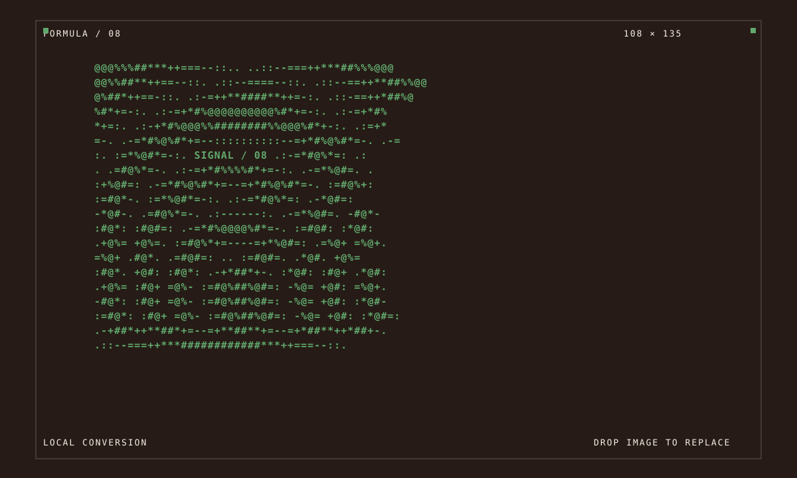

<div align="center">

# Formulasearch Aesthetic Formulas

把日常的审美观察，做成可直接体验、下载和改造的浏览器视觉工具。

[浏览全部项目](https://fanzr-arch.github.io/Phil-aesthetic-formulas/) · [关注 X / @Formulasearch](https://x.com/Formulasearch) · [UI Kit 文档](tools/formula-lab/README.md)

</div>

## 现在有什么

本仓库当前发布 4 个可独立运行的 HTML / CSS / JavaScript 视觉实验。无需后端；每个项目的 `template/` 都包含它运行所需的本地资源，可部署到 GitHub Pages、任意静态站点，或直接离线打开。

[](https://fanzr-arch.github.io/Phil-aesthetic-formulas/008-ascii-signal/template/)

| 编号 | 实验 | 能做什么 | 在线体验 |
| --- | --- | --- | --- |
| 008 | [ASCII Signal · 图片转字符画](008-ascii-signal/) | 将图片按亮度转换为可复制的字符画，支持密度、对比度、反相与字符集。 | [打开工具](https://fanzr-arch.github.io/Phil-aesthetic-formulas/008-ascii-signal/template/) |
| 007 | [虹彩液态 · RGB 网点](007-iridescent-flow-halftone/) | 可交互的 WebGL 液态色彩与 RGB 半调视觉，支持实时参数调整。 | [打开工具](https://fanzr-arch.github.io/Phil-aesthetic-formulas/007-iridescent-flow-halftone/template/) |
| 006 | [模块网格拼贴海报](006-grid-collage-poster/) | 把文字与图片编入模块网格，生成可复现、可导出的海报版式。 | [打开工具](https://fanzr-arch.github.io/Phil-aesthetic-formulas/006-grid-collage-poster/template/) |
| 005 | [故障艺术 · 文字肖像](005-typographic-portrait/) | 用文字密度、动态模糊和失焦关系重绘照片。 | [打开工具](https://fanzr-arch.github.io/Phil-aesthetic-formulas/005-typographic-portrait/template/) |

桌面端画廊支持 `1` 至 `4` 快捷键打开对应项目；每个工具顶部的 **ALL PROJECTS** 都可返回画廊。

## 固定的 Formula Lab UI Kit

工具的作品视觉可以变化，但操作界面不再每个项目重新设计。公共源位于 [`tools/formula-lab/`](tools/formula-lab/)，每个已发布项目保存一份本地快照，因此既统一又不会让旧项目被后续更新意外改坏。

固定组件包括：

- 控制面板、分组标题和字段标签
- 输入框、分段选择器、复选项和按钮操作区
- 画布舞台、状态提示、抽屉开关和可访问对话框
- 桌面与移动端布局、键盘焦点、`Escape` 关闭和低动态偏好

动效也遵循同一规则：点击反馈为 160–180ms，抽屉为 240ms 的 `transform` 过渡；系统启用“减少动态效果”时，非必要动画会关闭，007 的实时渲染默认暂停。详见 [UI Kit 说明](tools/formula-lab/README.md) 与 [Shell 使用规范](UI_SHELL.md)。

## 仓库结构

```text
tools/formula-lab/                  # UI Kit 的唯一公共源、画廊和校验脚本
_template/                          # 新实验的起点，包含当前 UI Kit 本地快照
005-typographic-portrait/template/  # 已发布项目及其独立运行快照
006-grid-collage-poster/template/
007-iridescent-flow-halftone/template/
008-ascii-signal/template/
```

## 使用与维护

### 使用现成工具

1. 在上表中打开在线工具，或下载对应项目文件夹。
2. 双击 `template/index.html` 即可本地使用。
3. 在项目自己的 JavaScript、文案和画布逻辑中做改造；通用界面资源已经随 `template/` 一起提供。

### 新建或维护实验

1. 从 [`_template/`](./_template/) 创建项目，保留其中的 `template/` UI 快照。
2. 需要更新统一界面时，先修改 [`tools/formula-lab/`](tools/formula-lab/)，再明确执行同步，而不是在各项目里各写一套。
3. 发布前运行：

   ```powershell
   .\tools\check-lab-ui.ps1 -Strict
   ```

   该检查会校验快照一致性、公共组件标记和动效限制。

## 开源与第三方说明

项目代码和各项目的许可说明在对应目录中。公共 UI Kit 的第三方依赖与归属见 [THIRD_PARTY_NOTICES.md](tools/formula-lab/THIRD_PARTY_NOTICES.md)；007 的 WebGL 相关说明见其 [项目目录](007-iridescent-flow-halftone/)。

公开仓库只保留可直接预览、下载或复用的最终成果；制作过程、内部研究材料和草稿不纳入发布内容。

---

每天的审美分享发布在 [@Formulasearch](https://x.com/Formulasearch)。
