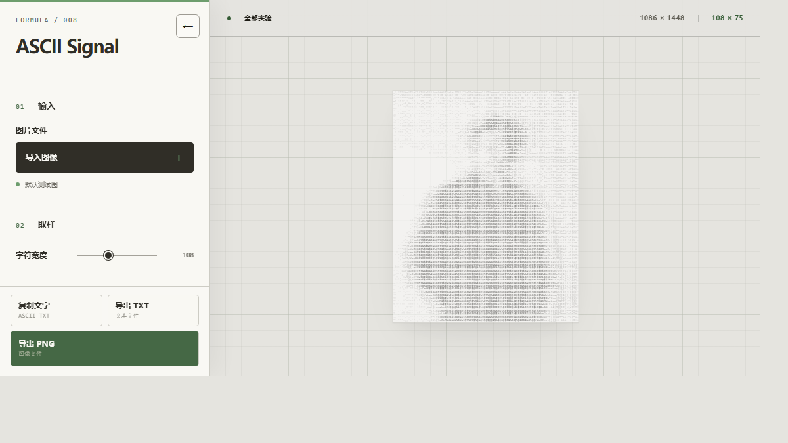
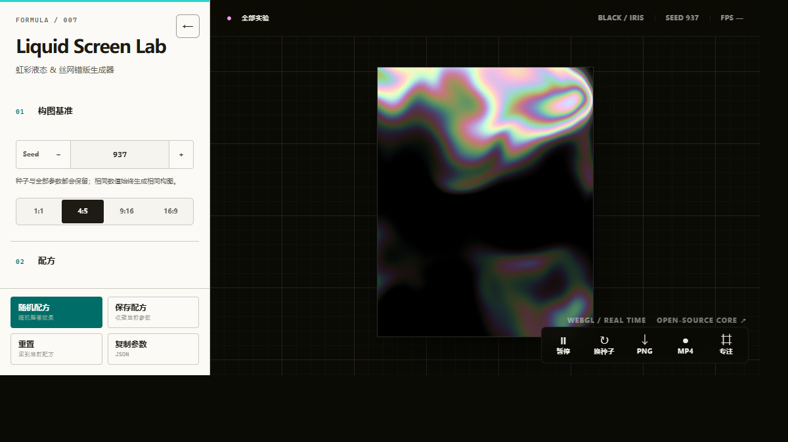
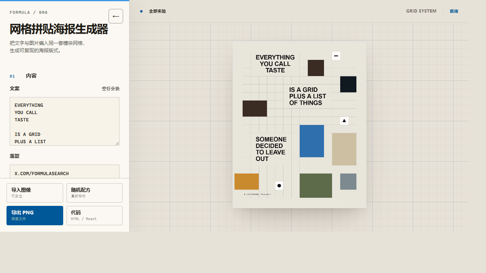
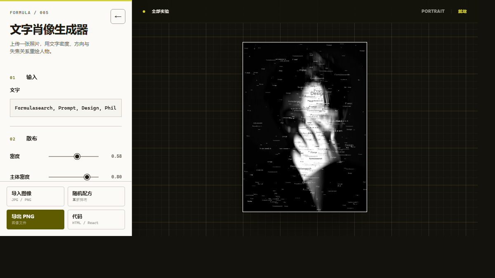

<div align="center">

# Formulasearch Aesthetic Formulas

把日常的审美观察，做成可以直接体验、下载与改造的浏览器视觉工具。

[在线画廊](https://fanzr-arch.github.io/Phil-aesthetic-formulas/) · [Formula Lab UI Kit v3](tools/formula-lab/README.md) · [X / @Formulasearch](https://x.com/Formulasearch)

</div>

## 已发布项目

当前包含 4 个零构建、无后端的视觉实验。每个项目都保留完整的本地运行文件，可部署到静态网站，也可以下载后离线打开。

<table>
  <tr>
    <td width="50%" valign="top">
      <a href="https://fanzr-arch.github.io/Phil-aesthetic-formulas/008-ascii-signal/template/">
        
      </a>
      <h3>008 · ASCII Signal</h3>
      <p>把图片按亮度转换为可复制的字符画，可调整密度、对比度、细节、反相与字符集。</p>
      <p><a href="https://fanzr-arch.github.io/Phil-aesthetic-formulas/008-ascii-signal/template/">在线体验</a> · <a href="008-ascii-signal/">源码与说明</a></p>
    </td>
    <td width="50%" valign="top">
      <a href="https://fanzr-arch.github.io/Phil-aesthetic-formulas/007-iridescent-flow-halftone/template/">
        
      </a>
      <h3>007 · Liquid Screen Lab</h3>
      <p>实时生成虹彩液态与 RGB 网点错版效果，支持比例、运动、形态、质感和导出参数。</p>
      <p><a href="https://fanzr-arch.github.io/Phil-aesthetic-formulas/007-iridescent-flow-halftone/template/">在线体验</a> · <a href="007-iridescent-flow-halftone/">源码与说明</a></p>
    </td>
  </tr>
  <tr>
    <td width="50%" valign="top">
      <a href="https://fanzr-arch.github.io/Phil-aesthetic-formulas/006-grid-collage-poster/template/">
        
      </a>
      <h3>006 · 网格拼贴海报生成器</h3>
      <p>把文字与多张图片编入模块网格，生成可复现、可调整、可导出的海报版式。</p>
      <p><a href="https://fanzr-arch.github.io/Phil-aesthetic-formulas/006-grid-collage-poster/template/">在线体验</a> · <a href="006-grid-collage-poster/">源码与说明</a></p>
    </td>
    <td width="50%" valign="top">
      <a href="https://fanzr-arch.github.io/Phil-aesthetic-formulas/005-typographic-portrait/template/">
        
      </a>
      <h3>005 · 文字肖像生成器</h3>
      <p>使用文字密度、动态模糊、方向和失焦关系重绘照片，生成故障艺术文字肖像。</p>
      <p><a href="https://fanzr-arch.github.io/Phil-aesthetic-formulas/005-typographic-portrait/template/">在线体验</a> · <a href="005-typographic-portrait/">源码与说明</a></p>
    </td>
  </tr>
</table>

桌面端画廊支持数字键 `1`–`4` 快速打开项目；每个工具顶部的“全部实验”都可以返回画廊。

## 如何使用

1. 点击项目卡片中的“在线体验”直接使用。
2. 需要离线运行时，下载对应项目目录并打开 `template/index.html`。
3. 所有资源均保存在项目内部，不依赖 CDN、后端服务或构建步骤。

## Formula Lab UI Kit v3

四个作品的视觉方向可以不同，但参数面板、控件、画板与交互语言使用同一套组件系统：

- 统一标题层级、字段排版、按钮操作区和响应式面板
- 数值保持单行，选中、悬浮与键盘焦点使用不同状态
- 画板根据可用空间完整缩放，阴影不会被裁切
- 桌面与移动端共享收起逻辑、触控尺寸和减弱动态规则

公共源码位于 [`tools/formula-lab/`](tools/formula-lab/)，新实验从 [`_template/`](./_template/) 开始。完整约束与验收规则见 [`UI_SHELL.md`](UI_SHELL.md)。

## 新建或维护实验

```powershell
# 创建新项目
.\tools\new-issue.ps1 -Number 9 -Slug example -Title "示例工具"

# 发布前校验组件、快照和动效规则
.\tools\check-lab-ui.ps1 -Strict
```

已发布项目各自保存 UI Kit 本地快照。更新公共界面时先修改 `tools/formula-lab/`，再显式同步到指定项目，避免旧作品被意外改变。

## 开源说明

项目许可、上游来源和第三方归属记录在各项目目录中。公共 UI Kit 的依赖声明见 [`tools/formula-lab/THIRD_PARTY_NOTICES.md`](tools/formula-lab/THIRD_PARTY_NOTICES.md)，007 的 WebGL 相关说明见其 [`THIRD_PARTY_NOTICES.md`](007-iridescent-flow-halftone/THIRD_PARTY_NOTICES.md)。

公开仓库只保留可以直接体验、下载或复用的最终成果，不包含制作过程、内部研究资料和草稿。

---

每天的审美分享发布在 [@Formulasearch](https://x.com/Formulasearch)。
