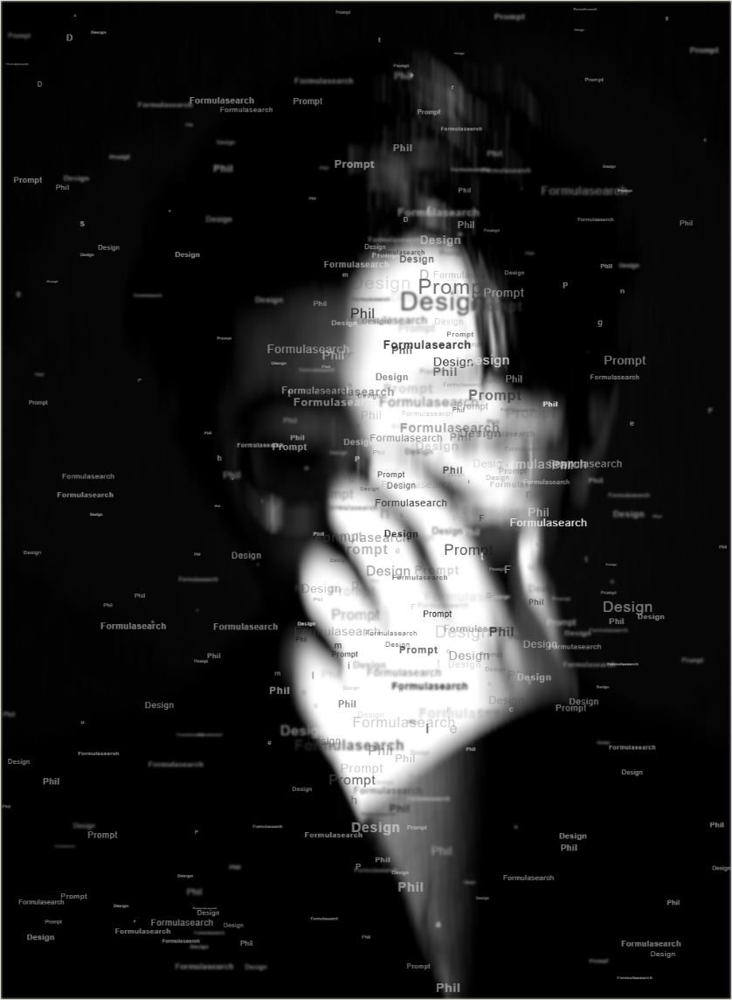

# 审美分享 × 可复用视觉实验

把每天的审美观察，复刻成可以直接体验、下载和改造的视觉工具。

[浏览全部项目](https://fanzr-arch.github.io/Phil-aesthetic-formulas/) · [关注 X / @Formulasearch](https://x.com/Formulasearch) · [Formula Lab Shell](UI_SHELL.md)

## 最新项目

### 08 · ASCII Signal · 图片转字符画

上传一张图片，按亮度将它转换成可复制的真实字符画。支持字符密度、对比、反相和字符表切换，处理不离开浏览器。

[**在线体验**](https://fanzr-arch.github.io/Phil-aesthetic-formulas/008-ascii-signal/template/) · [查看项目说明](008-ascii-signal/)

## 全部实验

<table>
  <tr>
    <td width="50%" valign="top">
      
       FORMULA / 008
      <h3>ASCII Signal · 图片转字符画</h3>
      
把任意图片压缩成可复制的真实字符画；本地处理，适合 README、终端与社交图像。

      
<a href="https://fanzr-arch.github.io/Phil-aesthetic-formulas/008-ascii-signal/template/"><strong>在线体验</strong></a> · <a href="008-ascii-signal/">项目说明</a>

    </td>
  </tr>
  <tr>
    <td width="50%" valign="top">
      
       FORMULA / 006
      <h3>模块网格拼贴海报</h3>
      
把文字与图片编入模块网格，快速生成可复现、可导出的海报版式。

      
<a href="https://fanzr-arch.github.io/Phil-aesthetic-formulas/006-grid-collage-poster/template/"><strong>在线体验</strong></a> · <a href="006-grid-collage-poster/">项目说明</a>

    </td>
    <td width="50%" valign="top">
      
       FORMULA / 005
      <h3>故障艺术 × 文字肖像</h3>
      
用文字密度、动态模糊和失焦关系重绘照片，也可把效果嵌入自己的网页。

      
<a href="https://fanzr-arch.github.io/Phil-aesthetic-formulas/005-typographic-portrait/template/"><strong>在线体验</strong></a> · <a href="005-typographic-portrait/">项目说明</a>

    </td>
  </tr>
</table>

> 在在线画廊中点击缩略图即可进入工具；桌面端也可以按 `1`、`2`、`3` 快速打开不同项目。每个工具顶部都有 `ALL PROJECTS`，可以随时返回画廊。

## 这里有什么

| 类型 | 用途 | 适合什么内容 |
|---|---|---|
| **代码模板** | 零构建、离线可用的 HTML/CSS/JS 工具 | 界面交互、生成器、排版布局 |
| **Skill** | 把视觉风格拆成稳定规则，输入主题即可生成成品提示词 | 图像风格、视觉语言、封面与海报 |

## 怎么拿走

### 使用代码模板

1. 在上方选择项目并点击「在线体验」。
2. 下载对应项目文件夹，双击打开 `template/index.html`。
3. 修改项目自己的参数、文案和画布逻辑；通用菜单由 Formula Lab Shell 提供。

所有运行资源都放在项目自己的 `template/` 内，使用相对路径，不依赖 CDN。项目可以部署到 GitHub Pages、个人网站任意子目录，也可以离线打开。

### 使用 Skill

把项目中的 `skill/` 文件夹复制到你的 Skills 目录，并按该项目 README 中的触发方式使用。

## 统一工具界面

所有交互型项目使用 [Formula Lab Shell](UI_SHELL.md)：

- 固定参数面板、分组、动作区、画布状态栏和移动端收起方式
- 每一期可以独立改变颜色、字体、控件和作品视觉
- 新项目从 `_template/` 创建，自动获得当前 Shell 的本地快照
- 已发布项目默认冻结，不会被后续 Shell 更新意外改变

## 发布范围

公开仓库只保留可以直接预览、下载或复用的最终版本。制作过程、内部策略、研究素材、原始输入和草稿不进入公开仓库。

---

每天的审美分享发布在 [@Formulasearch](https://x.com/Formulasearch)。
